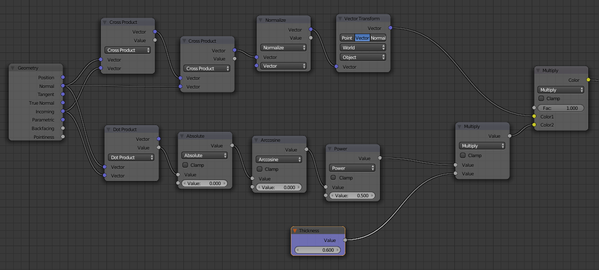

# Simple parallax mapping
```glsl
vec2 depthify(vec2 ST, float _M, vec3 N, vec3 CP, mat4 W){
	// _M = Parallax Depth
	// N = Normal
	// CP = Eye Vector
	// W = To-World matrix
	N = (W * vec4(N,0.0)).xyz;
	CP = (CP-N);
	CP = normalize(CP);
	
	vec3 I = CP;
	vec3 NI = cross(N,I);
	NI = cross(NI,N);
	NI = normalize(NI); // can cause artifacting
	NI = (transpose(W) * vec4(NI,0.0)).xyz;
	
	float DN = abs(dot(N,I));
	DN = acos(DN) * -_M;
	
	NI = NI * DN;
	
	return ST - NI.xz;
}
```

Ported from Blender material nodes.

From [an answer on Blender StackExchange](https://blender.stackexchange.com/questions/40997/how-can-i-make-a-hexagonal-grill/78003#78003)
on a question asking about how to create a hexagonal grill.

